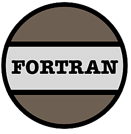
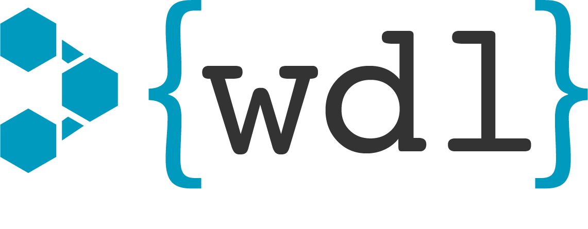

<h1 align="center">
 Hello there, I'm Faith Griffin.</h1>
 
### About Me
- 📗 I’m currently studying at **De La Salle University - Manila, Philippines**. 
- 🖥️ I'm on my **Third Year** taking up **Bachelor of Science in Computer Science Major in Software Technology**.
- 📧 Feel free to email me via **faith_griffin@dlsu.edu.ph**
- 🪄 Fun fact about me: I love penguins 🐧

### What I've been doing lately
- ✏️ learning everything I can with so little time hehe😴
- 🧬 reconstructing a phylogenetic tree of clinical strains of _Candida albicans_ in collaboration with **[DLSU's Bioinformatics Lab](https://bioinfodlsu.com/)**
- 📨 working on a Facebook messenger bot, under **[Tatak Tech Solutions](https://www.facebook.com/tataktech)**, for a local pastry shop - **[Walang Tatak](https://www.facebook.com/WalangTatak)**

### Languages and Tools

 
 

  
   
 

 
 

 
 
 

 
 

 

